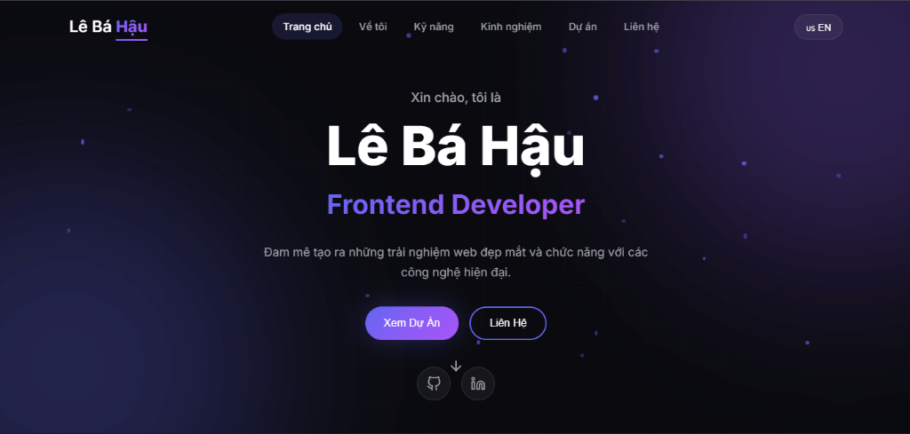

# Lê Bá Hậu - Portfolio

Modern portfolio website built with React + Vite + TypeScript.



## 🚀 Features

- ⚡ **React 18** with Vite for fast development
- 📝 **TypeScript** for type safety
- 🎨 **Framer Motion** for smooth animations
- 🌐 **i18n** - English/Vietnamese language support
- 📧 **EmailJS** - Contact form with email integration
- 📱 **Responsive** - Mobile-first design
- 🌙 **Dark Theme** - Premium dark UI

## 🛠️ Tech Stack

- React + Vite
- TypeScript
- Framer Motion
- react-i18next
- EmailJS
- react-icons

## 📦 Installation

```bash
# Clone the repository
git clone https://github.com/haubtm/portfolio.git

# Navigate to the project
cd portfolio

# Install dependencies
npm install

# Create .env file (copy from .env.example)
cp .env.example .env
# Then fill in your EmailJS credentials

# Start development server
npm run dev
```

## ⚙️ Environment Variables

Create a `.env` file in the root directory with the following variables:

```env
VITE_EMAILJS_SERVICE_ID=your_service_id
VITE_EMAILJS_TEMPLATE_ID=your_template_id
VITE_EMAILJS_PUBLIC_KEY=your_public_key
```

Get your EmailJS credentials from [EmailJS Dashboard](https://dashboard.emailjs.com/).

## 📁 Project Structure

```
src/
├── components/     # Reusable components (Navbar, Footer)
├── sections/       # Page sections (Hero, About, Skills, etc.)
├── i18n/          # Translations (en.json, vi.json)
└── index.css      # Global styles & design system
```

## 🚀 Deployment

```bash
# Build for production
npm run build

# Preview production build
npm run preview
```

## 📧 Contact

- **Email:** haubtm699@gmail.com
- **GitHub:** [haubtm](https://github.com/haubtm)
- **LinkedIn:** [Lê Bá Hậu](https://www.linkedin.com/in/bá-hậu-lê-97b15a35a/)

## 📄 License

MIT License - feel free to use this project for your own portfolio!
